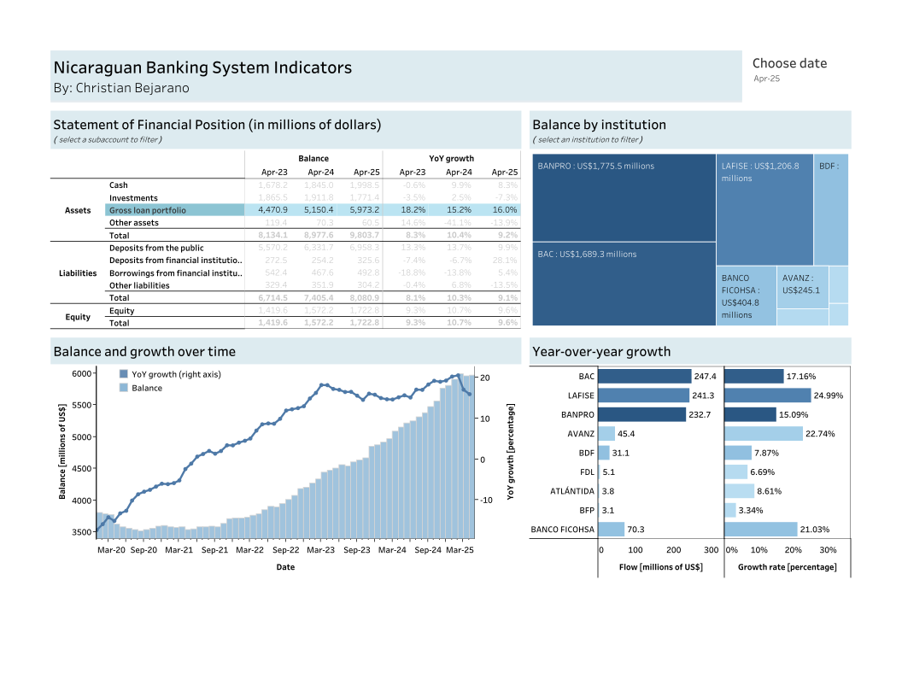
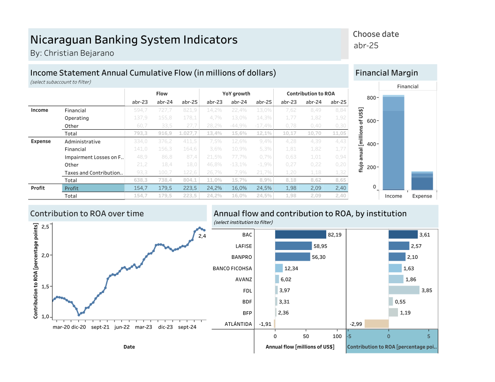

# Nicaraguan Banking System Indicators (NBSI)

## Project Overview

Nicaragua is a small open economy in Central America. Its banking sector is also small and shallow, yet it ranks among the most profitable in the region. This project presents a comprehensive set of banking-system indicators built from publicly available data.

The repository includes:

- Download and preprocessing script for SIBOIF banking-system data — [View code](https://github.com/bejarano-ch/Nicaraguan-Banking-System-Indicators/blob/main/codes/download_data_SIBOIF.R)
- Download official exchange-rate data from the Central Bank of Nicaragua — [View code](https://github.com/bejarano-ch/Nicaraguan-Banking-System-Indicators/blob/main/codes/download_exchange_rate.R)
- Interactive Tableau dashboards:
    - Statement of Financial Position — [View dashboard](https://public.tableau.com/app/profile/christian.bejarano5490/viz/StatementofFinancialPosition/Dashboard)
    - Income Statement — [View dashboard](https://public.tableau.com/app/profile/christian.bejarano5490/viz/IncomeStatement_17496622854550/Dashboard1)

## Project Structure

```
├── codes/           # R scripts for data processing and analysis
│   ├── download_data_SIBOIF.R    # Script for downloading SIBOIF data
│   └── download_exchange_rate.R   # Script for downloading exchange rate data
├── data/           # Raw and processed data files
├── tableau/        # Tableau workbooks and visualizations
└── NBSI.Rproj      # R project configuration
```

## Key Insights:

- El sistema bancario nicaragüense administra un total de 9,803.7 millones de dólares en activos al mes de abril 2025
- Es un sistema tradicional, donde la cartera bruta de créditos constituye el principal activo
- La cartera bruta de créditos totaliza 5,973.1 millones de dólares
- Los créditos representan el 60.9 por ciento del total de activos






## Data Sources and Methodology

### Primary Data Sources
- SIBOIF (Superintendencia de Bancos y Otras Instituciones Financieras)
  - Monthly banking system reports
  - Individual bank financial statements
  - Regulatory reports
- Central Bank of Nicaragua (BCN)
  - Daily exchange rates
  - Macroeconomic indicators

### Data Processing
1. Raw data is downloaded from official sources
2. Data is cleaned and standardized
3. Monetary values are converted to USD using official exchange rates
4. Key ratios and indicators are calculated
5. Results are exported for visualization in Tableau


## Contact

Christian Bejarano  
📧 [christian.bejarano.ch@gmail.com](mailto:christian.bejarano.ch@gmail.com)  
🔗 [GitHub Repository](https://github.com/bejarano-ch/Nicaraguan-Banking-System-Indicators) 